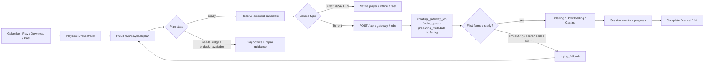
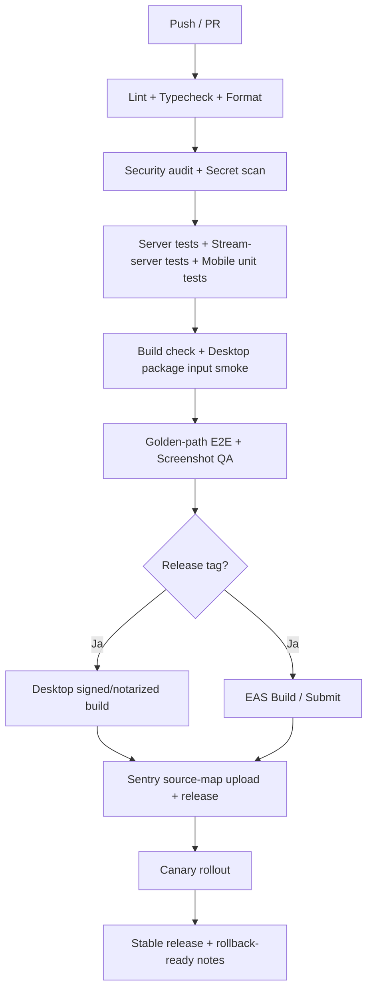

# Validatie en agent-roadmap voor BBrowns/streamer

## Managementsamenvatting

De `streamer`-repo staat duidelijk verder dan de oorspronkelijke “maak Play Best betrouwbaar”-fase. In `master` zijn inmiddels de kern van de session-driven playback control plane, download- en cast-sessies, gateway-hardening, signed gateway stream-URL’s, redaction van gevoelige logging, Sentry-baselines, packaged desktop-sidecar-inputs, een design-system-pilot en meerdere UX-polish PR’s voor detail, player, downloads en desktop-keyboardnavigatie al gemerged via PR’s `#70` t/m `#86`. Dat is zichtbaar in de commitgeschiedenis van 4 en 5 juni 2026. citeturn27view0turn28view0turn45view2

Mijn hoofdconclusie is daarom: **geen macro-architectuur rewrite nodig**. De huidige vorm — Expo/React Native client, Hono API, shared contracts, een lokale `stream-server` bridge voor torrent/gateway/cast, plus een optionele Electron-shell — is nog steeds de juiste basis voor een click-and-play streaming-app. Wat wél ontbreekt is de laatste productierijping: echte device-validatie, robuuste seekbare remux-output, een hard releasepad voor desktop en mobile, expliciete bridge-repair/diagnostics, golden-path E2E-automatisering, en privacy/release-operaties. citeturn23view0turn22view4turn22view5turn45view0turn45view1turn26view6

De repo is dus **geen prototype meer**, maar ook **nog niet production-ready**. De belangrijkste open gaten zijn: real-device validatie voor playback/download/cast, seek-support voor FFmpeg-remuxed output, release pipelines voor desktop en mobile, correcte source-map upload en release health in Sentry, een strakkere security-review rond bridge/IPC/CORS/auth, en end-to-end verificatie van privacy-export en accountverwijdering. De eigen handoff-documentatie noemt precies die punten nog als open voordat de app “production-ready” kan heten. citeturn45view0turn45view1turn45view2

Omdat ik in `master` geen apart, versioned bestand met de naam “roadmap v3” aantrof, heb ik hieronder **een genormaliseerde roadmap v3 voor PR `#87`–`#103`** opgesteld op basis van wat ná de laatst gemergde PR `#86` logisch resteert. De repo bevat wel `AGENT_HANDOFF.md`, `ARCHITECTURE.md`, `UI.md`, `API.md` en `docs/openapi.yaml`, maar geen aparte v3-roadmapfile; bovendien liep de validatie in deze sessie via de publieke GitHub-repo-pagina’s. citeturn4view0turn25view0turn27view0

## Huidige stand en validatie van roadmap v3

De tabel hieronder mapt de genormaliseerde PR’s `#87`–`#103` op de huidige status van `master`: **done**, **partly** of **due**. In de praktijk zijn de meeste items **partly**: het fundament ligt er, maar de productie-afronding ontbreekt nog.

| PR     | Genormaliseerde titel                                 |     Status | Bewijs uit repo                                                                                                                                                                                                                                                                                                                                                                                                            | Aanbevolen volgende stap                                                                                                                                              |
| ------ | ----------------------------------------------------- | ---------: | -------------------------------------------------------------------------------------------------------------------------------------------------------------------------------------------------------------------------------------------------------------------------------------------------------------------------------------------------------------------------------------------------------------------------- | --------------------------------------------------------------------------------------------------------------------------------------------------------------------- |
| `#87`  | Bridge runtime repair en diagnostics                  | **partly** | Native runtime mismatch wordt al gesurfacet als `unsupported bridge health`; packaged desktop sidecar-inputs zijn gemerged in PR `#79` (`ee12d7e` / `77c4a1d`), maar `ARCHITECTURE.md` noemt repair guidance nog expliciet open. citeturn45view0turn18view0turn22view3turn29view6turn28view0                                                                                                                        | Voeg een expliciet repair-contract toe: runtime metadata, CPU/arch mismatch details, self-test, in-app herstelknoppen en duidelijke helpteksten in Sources & Devices. |
| `#88`  | Seekable remux-output en FFmpeg output-strategie      |    **due** | De bridge ondersteunt remuxing, maar zowel `AGENT_HANDOFF.md` als `ARCHITECTURE.md` melden dat FFmpeg-remux-output nu sequentieel is en geen production-grade seek ondersteunt zonder packaged of persistente output. citeturn22view0turn45view0turn45view1                                                                                                                                                           | Maak remux-output seekable via persistente temp-bestanden of segment-gebaseerde output; claim pas daarna MKV→iOS/desktop seek-support.                                |
| `#89`  | Real-device playback validatiematrix                  | **partly** | PR `#72` (`babf029` / `33ea566`) hardent gateway range handling en cleanup, maar de handoff noemt real-device validatie van seeking, cancellation en cleanup nog open voor desktop, phone en web. citeturn28view0turn45view1                                                                                                                                                                                           | Maak een fixturematrix met 6–10 representatieve bronnen en voer handmatige en geautomatiseerde device-runs uit op iPhone, Android, macOS en web.                      |
| `#90`  | Download replan na restart en device-QA               | **partly** | Downloads zijn al via PlaybackSession en een persistente queue gegaan in PR `#70` (`edc49ac` / `9bba85b`) en zijn later UX-gepolisht in PR `#84` (`2151c8a` / `71a19d3`), maar de handoff noemt restart-recovery op echte devices en herplanning van verlopen retry-URL’s nog open; `ARCHITECTURE.md` noemt expliciet URL re-resolution na app restart. citeturn45view0turn45view1turn42view6turn28view0turn27view0 | Laat resumed downloads eerst opnieuw plannen/resolven voordat `Range` wordt hervat; valideer grote bestanden op desktop, iPhone en Android.                           |
| `#91`  | Cast en AirPlay capability-validatie                  | **partly** | Cast loopt al via PlaybackSession sinds PR `#71` (`fe73e49` / `a5baf76`), maar real-device validatie, AirPlay-uitlijning en rijkere capability discovery staan nog als open punt genoemd. De repo gebruikt `react-native-google-cast` op mobile en `castv2-client` in de bridge. citeturn45view0turn23view1turn22view5turn21view0turn28view0turn39view0                                                            | Test discovery/start/stop/fallback op echte Chromecast-hardware; laat iOS AirPlay zoveel mogelijk de native player-route gebruiken.                                   |
| `#92`  | Security hardening ronde twee                         | **partly** | Trust boundaries, signed stream URL’s en redaction zijn al gemerged in PR’s `#73`, `#74` en `#75`, maar de handoff noemt nog een gerichte productie-review nodig voor bridge, add-on URL’s, auth, cast URL’s en remote media URL’s. citeturn45view1turn45view2turn28view0                                                                                                                                             | Focus op IPC, CORS, outbound URL-validatie, token-hygiëne en release-secret governance; maak dit een kleine, expliciete hardening-PR.                                 |
| `#93`  | Sentry releases, source maps en breadcrumb-policy     | **partly** | Mobile, server/bridge en desktop Sentry baselines zijn al gemerged in PR’s `#76`, `#77` en `#78`, maar de repo-documentatie noemt source-map upload, sampling, release health en breadcrumb/exception-policy nog als open. citeturn45view2turn27view0                                                                                                                                                                  | Configureer releases per app/workspace, upload source maps in CI en verifieer dat breadcrumbs en events geen signed URL’s of tokens bevatten.                         |
| `#94`  | Golden-path E2E en screenshot-QA                      | **partly** | De huidige CI doet lint/typecheck/format/security audit/server tests/stream-server tests/mobile Jest/build-check/package input smoke, maar draait geen Detox in CI en geen browse→Play Best→fallback→download→cast golden-path flow; desktop/phone screenshot-QA staat nog expliciet open. citeturn13view0turn13view1turn13view2turn13view3turn14view1turn14view4turn39view0turn45view1                          | Voeg een echte golden-path testlaag toe en archiveer screenshots en logs als CI-artifacts.                                                                            |
| `#95`  | Desktop signed/notarized release en auto-update       | **partly** | `apps/desktop/package.json` bevat `electron-builder`, `electron-updater`, `package:dir` en `package:mac`; `electron-builder.json` target nu alleen `dir` op mac/win/linux en include resources voor `stream-server`, `vendor/node` en `node-datachannel`. De repo heeft nog geen releases gepubliceerd. citeturn17view0turn18view0turn26view6turn32search0turn32search16turn32search20                             | Maak signed/notarized builds, publish-config, release-upload en canary/stable updatekanalen.                                                                          |
| `#96`  | Mobile EAS Build/Submit automatisering                | **partly** | `apps/mobile/eas.json` bevat al `development`, `preview`, `production` en `submit` profielen, maar er is nog geen CI-releaseflow eromheen. citeturn41view0turn44search0turn44search8                                                                                                                                                                                                                                  | Koppel EAS Build/Submit aan GitHub Actions environments en release-tags.                                                                                              |
| `#97`  | Privacy export/delete en store privacy compliance     | **partly** | De API heeft al `GET /api/auth/export` en `DELETE /api/auth/account`, maar de handoff noemt end-to-end verificatie nog open. Vanuit AVG-perspectief zijn dataportabiliteit en verwijdering expliciete rechten. citeturn40view0turn45view1turn44search1turn44search5turn44search17                                                                                                                                   | Test export-JSON, cascading delete, token-invalidation, retention en privacyverklaringen end-to-end.                                                                  |
| `#98`  | Observability health, correlatie-id’s en dashboarding | **partly** | De Sentry/logredaction-baseline bestaat al, maar `ARCHITECTURE.md` noemt `AsyncLocalStorage` correlation IDs en betere surfacing van `/api/health` / gateway failures als open backlog. citeturn45view2turn42view3turn29view6                                                                                                                                                                                         | Voeg request/user correlation IDs, health-cardinals en een compacte operations-dashboardweergave toe.                                                                 |
| `#99`  | Settings en Sources & Devices IA polish               | **partly** | Settings is al opgedeeld in secties, maar de repo-documentatie zegt dat de gewenste IA nog scherper moet worden richting “Account, Sources & Devices, Playback, Downloads, Advanced”. citeturn23view6turn45view0                                                                                                                                                                                                       | Maak de instellingen expliciet taakgericht in plaats van featuregericht en voeg runtime diagnostics toe zonder technische overload.                                   |
| `#100` | Home en Discover UX round two                         | **partly** | `UI.md` beschrijft al een `HomeHeroBanner`, maar de handoff noemt Home/Discover nog niet op het gewenste Netflix/Disney+/Prime-niveau en wil provider rails, continue watching, aanbevelingen en betere filters behouden/uitbouwen. citeturn24view1turn45view1                                                                                                                                                         | Werk Home uit rond hero, continue watching, provider rails en bridge-status; werk Discover uit met provider/genre/quality/type filters.                               |
| `#101` | Detail- en player-polish round three                  | **partly** | Detail-Play-Best, player readiness, download queue UI, player controls en keyboard navigation zijn al gemerged in PR’s `#82`–`#86`, maar `UI.md` noemt nog verdere player-splitsing, toegankelijkheid en detail/player-finetuning als open. citeturn27view0turn28view0turn24view2turn43view0                                                                                                                         | Rond player accessibility, diagnostics, resume UX en desktop detail-focus af in één gerichte polish-wave.                                                             |
| `#102` | API/docs sync en release-runbooks                     | **partly** | Docs-sync is al gemerged in PR `#80`; in `docs/` staat al `openapi.yaml`. Tegelijk zegt `ARCHITECTURE.md` nog dat de OpenAPI-spec niet machine-generated uit validators komt. Dat wijst op docs-drift. citeturn27view0turn25view0turn42view4                                                                                                                                                                          | Maak één bron van waarheid: generated API contract, release-runbook, QA matrix en incident-repair runbook.                                                            |
| `#103` | Launch gate en canary-release                         |    **due** | De repo heeft geen gepubliceerde releases en de handoff noemt productie-readiness nog expliciet open. citeturn26view6turn45view1                                                                                                                                                                                                                                                                                       | Voeg een harde launch checklist toe met canary-distributie, rollback, smoke tests en go/no-go criteria.                                                               |

### Playback-sessie als control plane

De huidige architectuur wijst al in de goede richting: `Play Best` gaat via `PlaybackOrchestrator` naar `POST /api/playback/plan`, met ordered candidates, typed plan states en typed runtime states in de player. Dat is precies het juiste control-plane-patroon voor “click and play”; de ontbrekende stap is vooral het volwassen maken van de uitvoeringslaag eronder. citeturn40view0turn24view2turn23view0

Dit diagram is geen nieuwe architectuur, maar een normalisatie van wat de repo al doet en waar de documenten de open gaten benoemen: plan→resolve→gateway→typed readiness→fallback→session events. citeturn40view0turn24view2turn45view0

## Ontbrekende taken buiten roadmap v3

Niet alles wat belangrijk is voor productie valt netjes in de v3-hoofdroadmap. Er is daarnaast **ondersteunend platformwerk** nodig dat risico verlaagt en agent-handoffs stabieler maakt.

| Prioriteit | Domein               | Taak                                                        | Effort | Risico als je dit overslaat                                                                                                                                                                                                                                                                                       | Acceptatiecriteria                                                                                                                         |
| ---------- | -------------------- | ----------------------------------------------------------- | -----: | ----------------------------------------------------------------------------------------------------------------------------------------------------------------------------------------------------------------------------------------------------------------------------------------------------------------- | ------------------------------------------------------------------------------------------------------------------------------------------ |
| Hoog       | Security / CI        | **Security-audits echt gate-achtig maken**                  |      S | In de huidige CI staan dependency audit en `audit-ci` op `continue-on-error: true`; daardoor kan een release door met bekende security debt. citeturn13view2                                                                                                                                                   | Release-branches falen op high/critical dependency-vulns; uitzonderingen zijn expliciet geaccepteerd en gelogd.                            |
| Hoog       | Packaging / Security | **SBOM en dependency/governance-baseline**                  |      M | Zonder SBOM en vaste governance mis je een betrouwbare bron voor licentie-, supply-chain- en release-audits. GitHub Actions-secrets horen bovendien op environment-niveau, niet ad hoc. citeturn35search3turn35search20                                                                                       | SBOM per artifact, dependency allowlist/denylist, omgevinggebaseerde secrets en release provenance per build.                              |
| Hoog       | Observability        | **Generated API contracts en contract-diff gate**           |      M | De repo heeft al `docs/openapi.yaml`, maar `ARCHITECTURE.md` zegt tegelijk dat de spec niet machine-readable uit validators komt; dat is een klassiek docs-drift risico. citeturn25view0turn42view4                                                                                                           | OpenAPI wordt gegenereerd uit Zod/validators, CI faalt bij ongedocumenteerde API-wijzigingen, clients kunnen contract-tests draaien.       |
| Hoog       | Legal / Privacy      | **AVG-operationalisering**                                  |      M | Export/delete endpoints bestaan al, maar zonder retention-beleid, DPA-inventaris, privacyverklaring en app-store disclosures blijft juridische productie-readiness onvolledig. De AP noemt verwijdering en dataportabiliteit expliciet als rechten. citeturn40view0turn44search1turn44search5turn44search17 | Werkende DSAR-flow, retentiematrix, privacy policy update, Sentry/Expo/GitHub Documentatie, App Store / Play privacy formulieren ingevuld. |
| Midden     | Reliability          | **Manifest revalidatie voor add-ons**                       |      M | Add-on manifests worden anders stil verouderd, met onverwachte catalog- of streamfouten bij users. `ARCHITECTURE.md` noemt dit expliciet. citeturn42view5                                                                                                                                                      | Dagelijkse of geplande revalidatie met notificatie bij breaking manifest changes.                                                          |
| Midden     | Reliability / Scale  | **CircuitBreakerRegistry en health-exposure**               |      M | De huidige policy-cache is volgens de architectuur een module-level `Map`; zonder registry/health visibility groeit dit onzichtbaar en onbegrensd. citeturn42view5                                                                                                                                             | Bounded registry met health endpoint en zichtbare states per add-on.                                                                       |
| Midden     | Scale / Security     | **Redis-backed rate limiting**                              |      M | De huidige rate limiting is in-memory en daarmee niet correct zodra server/infrastructuur opschaalt naar meerdere instanties. citeturn42view6                                                                                                                                                                  | Centrale rate-limit store, multi-instance gedrag getest, abuse-gevallen beperken requests consistent.                                      |
| Midden     | Product / Playback   | **Torrent subtitle support**                                |    M/L | `IStreamEngine.getSubtitleTracks()` is volgens de architectuur nog incompleet voor torrents; dit blijft een user-visible kwaliteitsgat. citeturn23view0turn42view6                                                                                                                                            | Torrent-subtitles als losse HTTP endpoints, subtitle-track selectie zichtbaar in de player.                                                |
| Midden     | UX / Performance     | **Catalog pagination en stream-list virtualisatie**         |      M | `UI.md` noemt dat catalog-data nu te groot binnenkomt en streamlists nog in `ScrollView` hangen; dat gaat janken op zwakkere devices. citeturn43view0                                                                                                                                                          | `useInfiniteQuery`, `onEndReached`, `FlashList` voor bronlijsten, merkbaar minder scroll-jank.                                             |
| Midden     | Accessibility        | **Seek bar accessibility en keyboard/screen reader parity** |      M | De custom seek bar is nog niet toegankelijk; dat is zowel UX- als compliance-schuld. citeturn43view0                                                                                                                                                                                                           | `accessibilityRole="adjustable"`, keyboard events, screen-reader labels en E2E verificatie.                                                |

Mijn advies is om de eerste vier van deze lijst **niet** te parkeren na launch. Dit zijn geen “nice to haves”, maar releasekwaliteit en auditbaarheid.

## Aanbevolen libraries, tools en architectuurkeuzes

### Architectuuroordeel

De huidige monorepo-layout blijft de juiste ruggengraat. De repo beschrijft een Expo mobile/web-client, een Hono API-server, een shared contractlayer in `packages/shared`, een lokale `stream-server` daemon met WebTorrent en Chromecast-bridge, en een Electron-shell rond de web-app. Die opzet is coherent en al ver genoeg doorgevoerd dat een rewrite naar een Plex/Jellyfin-achtige centrale backend of een aparte transcodefarm vooral vertraging zou opleveren. citeturn22view4turn23view0

De architecturale aanpassingen die **wel** zinvol zijn, zijn gericht en klein:

1. **Bridge als expliciete, herstelbare packaged helper** in plaats van “een proces dat toevallig draait”.
2. **Seekable remux-output** als eerste klas bridge-functie.
3. **Release/observability/privacy ops** als volwassen laag rond de bestaande runtime. citeturn18view0turn29view6turn45view1

### Tool- en libraryvergelijking

| Domein                       | Aanbevolen keuze                                                      | Waarom dit nu de beste keuze is                                                                                                                                                                                                                                                      | Belangrijkste pluspunten                                                                                                      | Belangrijkste minpunten / compatibiliteit                                                                                                                                                                                                             |
| ---------------------------- | --------------------------------------------------------------------- | ------------------------------------------------------------------------------------------------------------------------------------------------------------------------------------------------------------------------------------------------------------------------------------ | ----------------------------------------------------------------------------------------------------------------------------- | ----------------------------------------------------------------------------------------------------------------------------------------------------------------------------------------------------------------------------------------------------- |
| Torrent engine               | **Blijf bij `webtorrent` in de lokale bridge**                        | De repo is hier al omheen ontworpen; WebTorrent documenteert dezelfde API voor Node en web, en de hele playback/gatewaylaag bouwt hier al op voort. citeturn21view0turn31search4turn31search12                                                                                  | Past bij huidige bridge-architectuur; streaming-first; weinig macro-omslag nodig.                                             | In Node verbindt `webtorrent` standaard niet met WebRTC peers; `webtorrent-hybrid` is hoogstens een **spike**, geen directe migratie. Desktop-packaging moet native bridge-resources blijven meeleveren. citeturn31search4turn18view0turn22view3 |
| Remux / transcode            | **FFmpeg CLI als expliciete packaged binary of host dependency**      | De repo gebruikt FFmpeg al conceptueel voor MKV→fMP4-remux; daar zit de functionele bottleneck. citeturn22view0turn23view0                                                                                                                                                       | Maximale controle; goed te isoleren in bridge; makkelijk testbaar met fixturebestanden.                                       | FFmpeg heeft echte license-implicaties: LGPL-baseline, maar GPL zodra je bepaalde optionele delen gebruikt. Dat moet expliciet in release/SBOM/compliance worden opgenomen. citeturn30search2turn30search6                                        |
| Mobile/web player            | **Blijf bij `expo-video`**                                            | De repo gebruikt `expo-video` al, en Expo documenteert het als cross-platform videocomponent met web support; subtitle tracks zijn ondersteund. citeturn39view0turn31search2turn34search2turn34search11                                                                        | Past bij Expo SDK 55; al aanwezig; goed genoeg voor click-and-play v1.                                                        | Niet elk advanced scenario is even diep als in volledig native players; iOS/HLS nuances blijven belangrijk. citeturn34search2                                                                                                                      |
| Mobile casting               | **Blijf bij `react-native-google-cast`**                              | De repo gebruikt het al; de officiële installatiedocs bevestigen de native Google Cast SDK-route. citeturn39view0turn31search7turn31search23                                                                                                                                    | Juiste native integratie voor iOS/Android; goede device hooks.                                                                | Native module-onderhoud blijft nodig; feature parity met desktop/web niet vanzelfsprekend.                                                                                                                                                            |
| Desktop/web casting          | **Blijf bij `castv2-client` + `bonjour-service` in de bridge**        | De repo heeft deze split al: native/mobile via Google Cast SDK, desktop/web via de bridge. citeturn21view0turn22view5                                                                                                                                                            | Past bij huidige Electron + sidecar-opzet; houdt castlogica uit de web-renderer.                                              | Device capability detection blijft zwakker dan bij een volledige sender/receiver-stack; real-device QA blijft verplicht. citeturn45view0                                                                                                           |
| Desktop packaging            | **Blijf bij `electron-builder` + `electron-updater`**                 | De repo gebruikt dit al; `electron-builder` is expliciet bedoeld voor packaging/distributie en `electron-updater` voor auto-updates. citeturn17view0turn32search0turn32search16turn32search20                                                                                  | Sluit aan op wat al in `apps/desktop` zit; sidecar resources zijn al voorbereid.                                              | Jullie config target nu alleen `dir`; je moet nog signing/notarization/publish toevoegen voordat auto-updates zinvol zijn. citeturn18view0turn26view6                                                                                             |
| Mobile release               | **Gebruik EAS Build + EAS Submit**                                    | `eas.json` is al aanwezig; EAS Build/Submit is officieel bedoeld voor distributie- en store-submissionflows. citeturn41view0turn44search0turn44search8turn44search24                                                                                                           | Past bij Expo-first architectuur; minder custom signing-tooling nodig.                                                        | Zonder CI-integratie blijft het handwerk en dus foutgevoelig.                                                                                                                                                                                         |
| Error tracking / source maps | **Maak Sentry-afronding af met source-map upload en release tagging** | Sentry baselines zijn al gemerged; officiële Sentry-docs zeggen expliciet dat readable stack traces source-map upload vereisen. citeturn45view2turn35search0turn35search1turn35search4turn35search13                                                                          | Jullie hebben de privacybasis al: `sendDefaultPii` uit en redaction in place. citeturn45view2turn35search6turn35search12 | Zonder release/source-map upload blijft productie-debugging halfblind.                                                                                                                                                                                |
| UI system                    | **Geen wholesale migratie; hooguit Tamagui als gerichte pilot**       | De repo gebruikt vooral `StyleSheet.create()` + theming; NativeWind is aanwezig maar niet dominant. Tamagui is interessant als cross-platform componentlaag, maar introduceert setup- en migratiewerk. citeturn23view7turn31search5turn31search13turn31search17turn31search25 | Kan shared primitives versnellen voor panelen, sheets en settings.                                                            | Niet nu app-breed invoeren; houd het bij één afgebakende pilot. Tamagui Pro heeft bovendien aparte commerciële voorwaarden. citeturn31search1                                                                                                      |

### Mijn concrete toolkeuzes

Als ik morgen één technische stack moest vastzetten voor productie, zou ik kiezen voor:

- **WebTorrent behouden** in de bridge, geen libtorrent-migratie.
- **FFmpeg als expliciete bridge-runtime** met packaged of beheerde binary en duidelijke compliance-keuze.
- **`expo-video` behouden** als player.
- **`react-native-google-cast` behouden** op mobile, **`castv2-client` behouden** op desktop/web.
- **`electron-builder` en `electron-updater` behouden**, maar de config uitbreiden naar signed distributie.
- **EAS Build/Submit** activeren voor mobile release.
- **Sentry CLI/Wizard plus release tagging** activeren in CI. citeturn31search2turn31search7turn32search0turn44search0turn35search0turn35search1

## UX-review voor click-and-play streaming

### Mobiel

De repo zit functioneel al dicht bij de juiste mobile UX: `Play Best` is primary, `More Sources` hoort advanced en collapsed te blijven, en de player gebruikt typed readiness states in plaats van een generiek “Buffering…”. Dat is inhoudelijk precies wat je wilt voor een streaming-app: de gebruiker moet niet kiezen uit de technische uitvoeringsdetails van je source-model, maar één primaire knop krijgen en daarna duidelijk, kalm en stap voor stap feedback zien. citeturn23view7turn24view2turn43view0

Voor iOS en Android zou ik de UX nu aanscherpen langs drie principes:

De eerste is **één dominante primaire actie**. Op detailpagina’s moet de visuele hiërarchie onmiskenbaar zijn: `Play Best` groot en direct, daarna pas `Download`, `Cast` en `Add`, met `More Sources` als secundair sheet of accordion. Dat sluit aan op de huidige repo-richting en op Apple’s videorichtlijnen, waar de content centraal hoort te blijven en de systeemplayerervaring de norm is. citeturn23view7turn33search0

De tweede is **progressieve readiness in mensentaal**. Materiële states zoals `creating_gateway_job`, `finding_peers`, `preparing_metadata`, `trying_fallback` en `failed_no_peers` bestaan al. Maak daar korte, begrijplijke UX-copy van, bijvoorbeeld: “Bron voorbereiden”, “Peers zoeken”, “Nog een bron proberen”, “Geen speelbare bron gevonden”. Material Design raadt expliciete progress indicators aan wanneer een proces tijd nodig heeft; de repo heeft die typed states al, dus benut ze volledig in plaats van nog meer spinners te introduceren. citeturn24view2turn34search15turn34search19

De derde is **offline en cast als verlengde van Play Best, niet als aparte wereld**. Downloads zijn in de repo al gegroepeerd in actieve/attention/ready-offline queues; cast gaat al via PlaybackSession. De UX moet dat nu zichtbaar maken door voor beide flows dezelfde statuswoorden, foutstijlen en fallbacktaal te gebruiken. Een download die nog geen geverifieerde lokale URI heeft, mag nergens als “offline klaar” verschijnen; dat principe zit al in de repo en moet UX-breed bewaakt blijven. citeturn45view0turn45view1

Concreet zou ik op mobile nog toevoegen:

- een **persistente kleine diagnostics-card** in Sources & Devices met maximaal drie user-facing states: “Bridge werkt”, “Bridge heeft reparatie nodig”, “Add-on/source traag of onbeschikbaar”;
- een **advanced More Sources bottom sheet** met zichtbare rejection reasons zoals “codec niet ondersteund”, “bridge vereist”, “geen peers”, in plaats van alleen ruwe source-strings;
- een **post-fallback toast/inline message**: “We proberen nu automatisch een andere bron”;
- een **‘up next’ / resume pad** dat nooit blockt, maar optioneel is;
- een **castsymbool dat altijd zichtbaar is wanneer cast beschikbaar is**, conform Google’s design checklist. citeturn33search2turn33search6turn24view2

### Web en desktop

Op desktop en web is de load anders: de gebruiker verwacht controle, keyboard support, meer diagnostics en sneller kunnen ingrijpen. De repo heeft hier al een basis voor met `usePlayerHotkeys`, keyboard-activation helpers en focus-rings; PR `#86` bracht extra desktop-keyboardnavigatie. Dat is precies het juiste spoor. citeturn24view2turn43view0turn27view0

Desktop UX moet daarom niet “mobiel maar groter” zijn, maar **krachtiger zonder technischer te voelen**. Mijn aanbeveling:

Maak de detail- en playerervaring **dual-layered**. De hoofdlaag blijft simpel: Play Best, voortgang, retry. De tweede laag is een **diagnostics pane** of right-side drawer waar je bridge health, geselecteerde candidate, fallback history, codec-incompatibiliteit en cast/airplay-availability toont. Daarmee houd je de primaire UX schoon, maar geef je desktopusers en support voldoende observability. Dat past ook bij het grotere scherm en de huidige keyboard-first richting. citeturn43view0turn45view0

Voor packaged desktop is een extra UX-principe onmisbaar: **self-healing instead of silent failure**. Omdat de repo al packaged runtimes en `node-datachannel` resources meeneemt, moet de app bij runtime mismatch of sidecar failure direct een heldere herstelactie aanbieden: “Bridge herstarten”, “Runtime controleren”, “Diagnostics kopiëren”. Dat voorkomt dat “unsupported” een doodlopend diagnostisch label blijft. citeturn18view0turn22view3turn29view6

Voor cast op desktop/web moet de UI duidelijk maken dat dit een **tweede scherm-flow** is: device kiezen, voorbereiding tonen, daarna remote-control bar. Google’s Cast-richtlijnen leggen nadruk op een voorspelbare flow en een zichtbare cast entry point. citeturn33search2turn34search3

### UX-pakketten die echt kunnen helpen

Er is één reeds aanwezige package die je actiever moet gebruiken: **`@shopify/flash-list`**. Die zit al in `apps/mobile/package.json`, en `UI.md` noemt zelf dat de streamlijst op de detailpagina nu nog in een `ScrollView` hangt. Dat is lage-hangende vrucht voor performance. citeturn39view0turn43view0

Voor design system en cross-platform primitives is **Tamagui hoogstens een pilot waard**, bijvoorbeeld voor Settings, panels, sheets en status surfaces. Niet voor een full-app migratie; daarvoor is de huidige codebasis te ver gevorderd in `StyleSheet` + `useTheme`, en de repo-documentatie zegt expliciet dat NativeWind slechts een minderheidspatroon is. citeturn23view7turn31search5turn31search17

## Security- en privacychecklist

De repo heeft al serieuze securitystappen gezet: add-on/private-network SSRF-hardening, signed playback URL’s, log redaction en privacy-first Sentry defaults. Dat is een sterke basis. Maar vóór productie hoort daar nog een expliciete test- en acceptatielaag bovenop. citeturn45view2turn45view0

| Onderdeel                        | Huidige basis                                                                                                                                                                                                                                                                        | Aanbevolen tests                                                                                                                                                                                                                                                             | Acceptatie                                                                                                                                         |
| -------------------------------- | ------------------------------------------------------------------------------------------------------------------------------------------------------------------------------------------------------------------------------------------------------------------------------------ | ---------------------------------------------------------------------------------------------------------------------------------------------------------------------------------------------------------------------------------------------------------------------------- | -------------------------------------------------------------------------------------------------------------------------------------------------- |
| SSRF en redirect-validatie       | Repo valideert add-on manifest/catalog/meta/stream targets, blokkeert private/internal/reserved IP’s standaard en revalideert redirects. citeturn45view1turn40view0                                                                                                              | Negatieve tests voor redirect chains, mixed-protocols, localhost/private IP’s, metadata-adressen en expliciete opt-in (`ADDON_ALLOW_PRIVATE_NETWORKS=true`) alleen in dev/test. Gebruik de OWASP SSRF-preventierichtlijnen als leidraad. citeturn32search3turn32search10 | Geen ongeautoriseerde outbound requests naar private netwerken; alle redirects worden opnieuw gevalideerd; dev-opt-ins lekken niet naar productie. |
| CORS en media-delivery           | Server heeft CORS-middleware; Google Cast vereist correcte CORS op media en tracks, zeker wanneer `Range` en tracks gebruikt worden. citeturn42view2turn44search3turn44search15                                                                                                 | Tests voor allowlist-origins, preflight, `Range`, track-URLs en cast-media vanuit willekeurige origins. Valideer met OWASP CORS testguides. citeturn36search3turn36search6                                                                                               | Alleen vertrouwde origins; geen wildcard-CORS op gevoelige resources; cast playback en subtitles blijven werken.                                   |
| Electron IPC en renderer-harding | Nog geen volledige audit zichtbaar in de onderzochte docs; Electron beveelt context isolation, sandboxing, een smalle `contextBridge`-API en strakke navigation/permission controls aan. citeturn30search1turn36search0turn36search1turn36search2turn36search7turn36search11 | Test dat renderer geen Node/Electron internals krijgt, alleen expliciete bridge methods; test deny-by-default voor nieuwe windows, permissies en externe navigatie.                                                                                                          | `contextIsolation=true`, sandbox aan, minimale preload API, geen onverwachte `window.open`, geen remote-content privilege escalation.              |
| Bridge auth en signed URLs       | Bridge-auth via bearer of `x-streamer-bridge-token` is aanwezig; signed gateway URLs zijn gemerged en getest. citeturn45view0turn45view2turn40view0                                                                                                                             | Negatieve tests voor alle control-routes: geen metrics/stats/cast/gateway zonder token; expired/tampered stream URLs falen; renewals werken voor actieve streams.                                                                                                            | Geen ongeauthenticeerde control-plane toegang; signed URLs verlopen correct; renewals breken actieve playback niet.                                |
| Token handling                   | De architectuur documenteert JWT access tokens, hashed refresh tokens, rotatie en `expo-secure-store` voor mobile storage; Sentry `sendDefaultPii` staat uit. citeturn22view3turn43view0turn35search2turn35search6                                                             | Tests voor login/refresh/logout/revoke/export/delete, plus log- en telemetry-tests die bewijzen dat tokens niet in logs, breadcrumbs of query strings belanden.                                                                                                              | Refresh tokens rouleren en worden ongeldig bij logout/account delete; geen token-lekkage in logs of Sentry.                                        |
| Privacyrechten                   | `GET /api/auth/export` en `DELETE /api/auth/account` bestaan al; AVG-rechten op dataportabiliteit en verwijdering zijn officieel relevant. citeturn40view0turn44search1turn44search5turn44search17                                                                             | End-to-end tests voor exportformat, volledigheid, delete-cascade, token invalidation en support runbook voor DSAR-verzoeken.                                                                                                                                                 | Eén werkende user journey voor export en delete; documenten en support-runbooks kloppen met de feitelijke implementatie.                           |

### Korte security/privacy checklist voor release

Voor de releasefase zou ik als harde checklist hanteren:

- SSRF- en redirect-tests groen.
- Bridge control-routes 401/403 zonder token.
- Signed playback URL’s mogen nergens in logs of breadcrumbs opduiken.
- Electron-renderer alleen via smalle `contextBridge`.
- Security-audits op release-branches zijn blocking, niet advisory.
- Privacy-export en account-delete zijn end-to-end bewezen.
- Sentry source maps zijn geüpload, maar source maps hoeven niet publiek beschikbaar te zijn. citeturn32search3turn36search4turn45view2turn13view2turn35search21

## Aanbevolen PR-volgorde en agent-ready tasklist

Mijn aanbevolen volgorde is **niet** eerst de grote visuele revamp. De beste volgorde is: eerst runtime-herstel en remux-seeking, daarna echte device-validatie, daarna release-hardening, en pas dán de grotere Home/Settings/Player-polish. Dat volgt rechtstreeks uit de huidige repo-status: functioneel is de control plane er al, operationeel nog niet. citeturn45view0turn45view1

De huidige CI in de repo dekt in grote lijnen stap `B` tot en met `E`; de release- en golden-path-lagen in dit diagram zijn dus het aanbevolen doelbeeld, niet de huidige realiteit. citeturn13view0turn13view1turn13view2turn13view3turn14view1turn26view6turn44search0turn35search0

### Agent-ready PR-tasklist

| PR     | Titel                                                    | Branchsuggestie                          | Scope                                                                                                                  | Tests                                                                                              | Acceptatiecriteria                                                                                                                |
| ------ | -------------------------------------------------------- | ---------------------------------------- | ---------------------------------------------------------------------------------------------------------------------- | -------------------------------------------------------------------------------------------------- | --------------------------------------------------------------------------------------------------------------------------------- |
| `#87`  | Bridge runtime repair en diagnostics                     | `agent/pr87-bridge-runtime-repair`       | Runtime metadata endpoint, CPU/arch mismatch detectie, health-to-repair mapping, UI-herstelacties in Sources & Devices | bridge unit/integration, desktop smoke, handmatige packaged Mac test                               | `unsupported` toont concrete oorzaak en herstelactie; bridge-health bevat runtime details; packaged desktop kan self-test draaien |
| `#88`  | Seekable remux-output voor MKV en codec-fallback         | `agent/pr88-remux-persistent-output`     | Persistente of temp-file remux strategy, seek-behoud, cleanup, abort-handling                                          | fixture-based ffmpeg tests, stream-server integration, real-file seek smoke                        | MKV remuxed playback kan seeken zonder byte-window fouten; cleanup lekt geen tempfiles                                            |
| `#89`  | Real-device playback validatiematrix                     | `agent/pr89-real-device-playback-matrix` | Fixturematrix, QA-runbook, device matrix (iPhone, Android, macOS, web), log capture                                    | handmatig + scripted smoke, artifact uploads                                                       | Voor elke fixture is resultaat vastgelegd: first frame, seek, fallback, cancel, cleanup                                           |
| `#90`  | Download resume replan en large-file device QA           | `agent/pr90-download-replan-restart`     | Fresh URL re-resolution na restart, retry semantics, device storage reporting                                          | mobile unit/integration, desktop restart recovery, large-file QA                                   | Geparkeerde download kan na app-restart hervatten zonder verlopen URL; “offline klaar” alleen na verified local URI               |
| `#91`  | Cast/AirPlay capability validatie                        | `agent/pr91-cast-airplay-validation`     | Chromecast fixture-flow, device capability mapping, AirPlay path alignment, richer user copy                           | native mobile tests waar mogelijk, real Chromecast QA, regression tests voor configured bridge URL | Cast start/stop/fallback werkt op echte devices; iOS AirPlay path blijft coherent met local playback                              |
| `#92`  | Security hardening ronde twee                            | `agent/pr92-security-hardening-round2`   | Release-branch security gates, IPC audit, CORS policy tests, outbound validation uitbreiden                            | negative auth tests, SSRF/CORS suite, Electron security checklist audit                            | Geen release zonder groene security gates; IPC/CORS/bridge auth policies zijn expliciet en getest                                 |
| `#93`  | Sentry releases en source maps                           | `agent/pr93-sentry-releases-sourcemaps`  | Release naming, source-map upload, breadcrumb policy, deployment metadata                                              | CI sourcemap upload validation, forced test exception per runtime                                  | Sentry stack traces zijn leesbaar in mobile/server/desktop; geen signed URLs of tokens in events                                  |
| `#94`  | Golden-path E2E en screenshot QA                         | `agent/pr94-golden-path-e2e`             | browse→detail→Play Best→fallback→download→cast testketen, screenshot artifacting                                       | mobile e2e, desktop/web smoke, artifact retention                                                  | Elke PR produceert golden-path bewijs en screenshots van phone + desktop                                                          |
| `#95`  | Desktop signed/notarized release en auto-update baseline | `agent/pr95-desktop-release-baseline`    | electron-builder publish config, signing/notarization, release artifact upload, update channels                        | package smoke, update feed smoke, manual install/upgrade test                                      | Downloadbare desktop artifacts bestaan; update-check werkt; release kan canary/stable splitsen                                    |
| `#96`  | Mobile EAS Build/Submit pipeline                         | `agent/pr96-mobile-eas-pipeline`         | GitHub Actions → EAS Build/Submit, environments/secrets, preview vs production lanes                                   | workflow dry-run, EAS preview build, store submission smoke                                        | Eén tag kan reproducible mobile builds maken; preview en production zijn gescheiden                                               |
| `#97`  | Privacy export/delete en app-store privacy pack          | `agent/pr97-privacy-e2e-pack`            | End-to-end DSAR validation, privacy docs, retention matrix, DPA inventory, store privacy forms                         | integration tests, manual compliance walkthrough                                                   | Export bevat correcte data; delete revokeert sessies/tokens; documentatie en store-declarations kloppen                           |
| `#98`  | Observability health en correlation IDs                  | `agent/pr98-observability-correlation`   | `AsyncLocalStorage` request/user correlation, bridge health surfacing, diagnostics cards                               | server tests, log assertions, UI smoke                                                             | Logregels zijn tracebaar per request/session; UI toont bruikbare, niet-technische diagnostics                                     |
| `#99`  | Settings en Sources & Devices IA polish                  | `agent/pr99-settings-sources-devices-ia` | Nieuwe IA: Account, Sources & Devices, Playback, Downloads, Advanced; bridge/add-on health wording                     | component tests, screenshot QA, keyboard checks                                                    | Settings is taakgericht en scanbaar; diagnostics helpen de gebruiker zonder jargon                                                |
| `#100` | Home en Discover UX round two                            | `agent/pr100-home-discover-round2`       | Hero refinements, continue watching, provider rails, aanbevelingen, Discover filters                                   | screenshot QA, performance sanity check                                                            | Home voelt als startpunt voor direct kijken; Discover behoudt provider-rails en wordt beter filterbaar                            |
| `#101` | Detail en player polish round three                      | `agent/pr101-detail-player-round3`       | More Sources advanced panel, diagnostics drawer, resume UX, player accessibility, final controls polish                | player unit tests, accessibility checks, screenshot QA                                             | Player voelt professioneel, More Sources blijft advanced, seek bar is toegankelijk                                                |
| `#102` | API/docs sync en release runbooks                        | `agent/pr102-api-docs-runbooks`          | Eén bron van waarheid voor API-contract, handoff docs, release checklist, QA matrix, repair runbook                    | contract-diff checks, docs lint                                                                    | Geen docs-drift tussen API, architecture, UI en runbooks; agent-handoffs zijn reproduceerbaar                                     |
| `#103` | Launch gate en canary release                            | `agent/pr103-launch-gate-canary`         | Go/no-go checklist, rollbackplan, canary cohort, post-release smoke                                                    | rehearsed release drill, rollback smoke                                                            | Release kan gecontroleerd live; rollback is getest; monitoring en privacy/security checks zijn onderdeel van go-live              |

### Definitieve prioriteitsvolgorde

Als ik dit morgen aan een agent zou geven, dan zou ik de volgorde als volgt aanhouden:

**Eerst** `#87` → `#88` → `#89`, omdat click-and-play pas betrouwbaar voelt als runtime-herstel, remux-seeking en echte device-validatie op orde zijn.  
**Daarna** `#90` → `#91` → `#92` → `#93` → `#94`, zodat download, cast, security, observability en golden-path QA dezelfde maturiteit krijgen.  
**Daarna pas** `#95` → `#96` → `#97` → `#98`, oftewel release pipelines, privacy-operaties en ops-visibility.  
**Als laatste** `#99` → `#100` → `#101` → `#102` → `#103`, de UX-afronding, docs-runbooks en launch gate. Deze volgorde sluit het best aan op de huidige stand van `master`. citeturn45view0turn45view1turn27view0turn28view0

### Open vragen en beperkingen

De twee belangrijkste beperkingen van deze validatie zijn overzichtelijk. Ten eerste was in deze sessie geen direct aanroepbare GitHub-connector zichtbaar, waardoor de validatie is gebaseerd op de publieke GitHub-repo-pagina’s van `BBrowns/streamer`, niet op een connector-API. Ten tweede trof ik in `master` geen apart versioned “roadmap v3”-document aan; daarom zijn PR’s `#87`–`#103` hierboven genormaliseerd op basis van de laatst gemergde PR `#86`, de repo-documentatie en de resterende gaps in `AGENT_HANDOFF.md`, `ARCHITECTURE.md`, `UI.md` en `API.md`. De onderliggende statusinschattingen zijn daardoor sterk onderbouwd, maar de exacte PR-titels zijn mijn aanbevolen normalisatie van de resterende roadmap.
