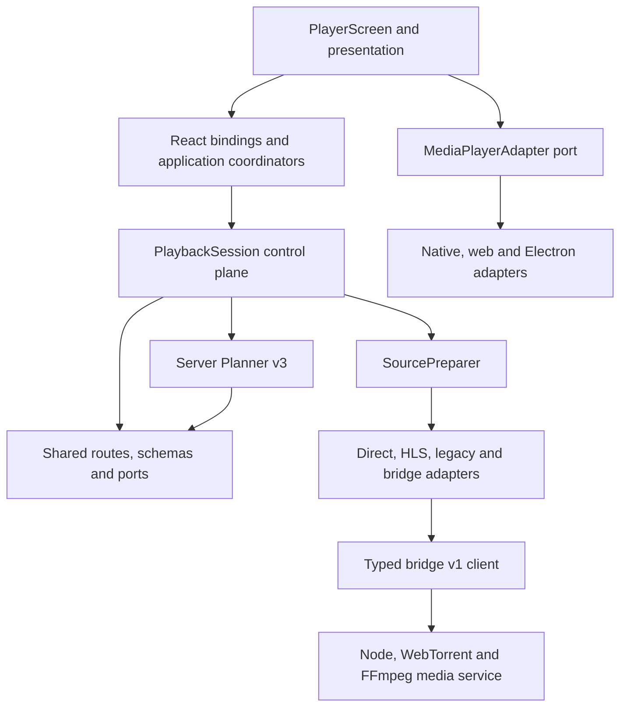

# Player Architecture

## Scope

This document describes the consumer playback path in `apps/mobile`, the local
stream gateway in `packages/stream-server`, and subtitle aggregation in
`server`. The persistence and trust rules in [PLAYBACK.md](../PLAYBACK.md) and
[docs/ADDON_TRUST_MODEL.md](./ADDON_TRUST_MODEL.md) remain authoritative.

The player is a composition surface around the existing `PlaybackSession`
control plane. It does not introduce a second persisted state machine.

The durable decisions behind this structure are recorded in
[the playback ADR index](./adr/README.md).

## Dependency Direction



Infrastructure adapters do not import screens. Runtime media values flow into
one active prepared-source lease, not into persisted control-plane state.

## Responsibility Migration

| Concern                          | Previous concentration                    | Current owner                                             |
| -------------------------------- | ----------------------------------------- | --------------------------------------------------------- |
| Candidate and fallback authority | Planner v2 plus player/engine inference   | Planner v3 route plus `PlaybackSessionPlaybackService`    |
| Direct/HLS/torrent preparation   | Player and broad stream engines           | `SourcePreparer` and route adapters                       |
| Bridge execution                 | Local gateway implementation details      | Shared bridge-v1 schemas, typed client and opaque runtime |
| Platform playback differences    | `Platform.OS` branches in player behavior | Native, web and Electron media adapters                   |
| Effective capability decisions   | URL/container/platform inference          | Pure route/runtime/adapter capability policy              |
| Runtime cleanup                  | Screen, engine and gateway callbacks      | Session-owned idempotent prepared-source lease            |
| Tracks and subtitles             | Several player/engine arrays              | Normalized deterministic catalog and subtitle renderer    |

## Boundaries

### Persisted control plane

`PlaybackSession` owns the durable, URL-free account of a Play, Download, or
Cast attempt:

- ordered opaque candidate snapshots
- serial attempt history
- gateway job identity
- accepted lifecycle events
- typed, sanitized terminal failures

It never stores a `Stream`, media URL, subtitle URL, magnet, info hash,
credential, bridge URL, or provider response.

### Runtime coordinator

`PlaybackRuntimeCoordinator.ts` combines session progress, media status and
transient interaction state into one discriminated player view state:

- planning
- preparing source
- loading media
- playing
- paused
- buffering
- scrubbing
- replacing source
- switching fallback
- completed
- failed
- cancelled

This state is runtime-only. It prevents contradictory UI such as “playing and
scrubbing” or “failed and preparing” from being represented as unrelated
booleans.

### Source preparation and runtime ownership

Planner v3 selects an explicit, URL-free `PlaybackRoute`: candidate ID,
execution target, delivery and the capabilities that route may expose.
`SourcePreparer` binds that route and action to one adapter and returns a
runtime-only `PreparedSource` lease. Direct, HLS, legacy-engine and bridge-v1
adapters all use the same lease contract.

The session service is the sole owner of the lease. It adopts a result only
when the session, candidate, exact attempt and complete route are still
current; late or mismatched results are released immediately. Player code can
read only an attempt-bound handoff containing the safe route, opaque bridge job
ID and optional runtime. It cannot read the lease release function through
that handoff or create a second engine for a session-owned source.

Resolve and fallback advances share one per-session single-flight. This keeps
source preparation serial and prevents concurrent failures from overwriting a
lease.

### Media adapter

`MediaPlayerAdapter.ts` is the platform-neutral player port. The implementations
in `mediaPlayerAdapters/` select native iOS/Android, web or Electron behavior
at the composition boundary. They normalize:

- status, playing and accepted time events
- duration and buffered position
- play, pause, precise seek and preview seek
- source replacement
- playback rate, mute and volume
- native audio and subtitle tracks
- thumbnail generation when the platform exposes it
- fullscreen and picture-in-picture through the concrete surface owned by the
  current player instance

Platform-specific `expo-video` behavior stays in these adapters. Web and
Electron fail closed for track selection that Expo does not expose. The
effective player capability is the intersection of the Planner v3 route,
runtime provider and concrete media adapter. Legacy inference is used only
when no v3 route exists.

### Bridge protocol v1 runtime

Bridge routes use the typed `BridgeClient` and `BridgeV1PlaybackRuntime`. The
bridge job is bound immutably to one opaque UUID, delivery and approved
local/LAN origin. Signed stream URLs exist only inside the active prepared
source lease and are never persisted or logged.

The runtime reuses that prepared job for lazy metrics, the URL-free track
catalog, bounded subtitle documents, bounded thumbnails and an optional
seekable-cache handoff. Every request carries the exact job ID. Runtime
`stop()` aborts observation only; releasing the prepared-source lease owns the
single bridge-job cancellation.

### Timeline

`TimelineController.ts` owns pure seek and scrub semantics.
`PlayerTimeline.tsx` owns pointer, touch, keyboard and accessibility input. The
timeline:

- separates preview position from committed position
- enables native scrubbing mode only during an active drag
- restores the previous play/pause intent after the drag
- reports buffered media only when the active player supplies it
- uses coarse thumbnail buckets and a bounded in-memory LRU
- degrades to a timestamp preview when thumbnails are unavailable
- remains visibly non-interactive for an honestly non-seekable source

Preview movement is not watch progress. A committed/accepted seek is.

### Track catalog and subtitle renderer

The client consumes normalized `AudioTrack`, `SubtitleTrack` and
`SubtitleCandidate` descriptors. The catalog combines:

- `expo-video` native audio tracks
- `expo-video` native embedded subtitles
- gateway-selected torrent-file subtitles
- gateway-selected embedded text subtitles
- installed Stremio subtitle add-ons

Only audio tracks exposed by the active `expo-video` source are presented as
selectable. Gateway audio descriptors remain discovery metadata until a
source-replacement capability can perform and verify the switch.

External subtitle documents are parsed into bounded, sanitized cues and
rendered by `ExternalSubtitleRenderer.tsx` from the accepted playback clock.
Switching an external subtitle never replaces or restarts video.

### Player chrome

The visible player has three disclosure layers:

1. Glance: title/context, Back, PiP/Cast and meaningful recovery status.
2. Controls: play/pause, seek, timeline, audio/subtitle access, volume and
   fullscreen.
3. Inspect: audio tracks, subtitle tracks and preferences, playback speed,
   URL-free diagnostics and manual recovery.

Technical transport details do not belong in the normal watch flow.

## Capability Matrix

This matrix describes the implemented contract behavior, not completed
real-device certification. A Planner route may further restrict every target.

| Capability                        | Native Expo Video                              | Web                                 | Electron renderer                     |
| --------------------------------- | ---------------------------------------------- | ----------------------------------- | ------------------------------------- |
| Seek                              | Route plus known duration/handoff              | Route plus known duration/handoff   | Route plus known duration/handoff     |
| Player volume                     | System-owned; no fake slider                   | Supported by player adapter         | Supported by renderer adapter         |
| Audio/embedded subtitle selection | Exposed only when Expo reports tracks          | Fail closed                         | Fail closed                           |
| External subtitles                | Route/runtime catalog plus renderer            | Route/runtime catalog plus renderer | Route/runtime catalog plus renderer   |
| Fullscreen                        | Current `VideoView` surface                    | Current player-owned video element  | Current player-owned video element    |
| Picture-in-picture                | OS/surface support                             | Browser/element support             | Browser/element support               |
| Timeline thumbnails               | Native generation or approved runtime provider | Approved bridge runtime only        | Native sidecar runtime provider       |
| Cast                              | Planner route and device flow                  | Planner route and device flow       | Planner route and sidecar/device flow |

Unsupported capabilities are hidden or return false/null; an adapter does not
pretend another platform's behavior exists.

## Play Press To First Rendered Frame

1. Detail or Continue Watching creates a runtime-only launch intent and opens
   the player immediately.
2. `PlaybackOrchestrator.playBest()` requests and validates Planner v3 output.
   Planner v2 remains an isolated compatibility input. The client creates a
   persistence-safe `PlaybackSession` and keeps raw candidates and routes only
   in memory.
3. `PlaybackSessionPlaybackService` selects the first eligible opaque
   candidate and prepares candidates serially through `SourcePreparer`.
   Torrent candidates are never raced through the singleton torrent engine.
4. Direct/HLS routes return a scoped runtime URI. A local-sidecar or
   paired-bridge torrent route creates one protocol-v1 gateway job bound to the
   exact selected torrent file.
5. Gateway readiness proves peer/metadata/first-byte conditions. A progressive
   fMP4 may become usable before optional seekable-cache preparation finishes.
6. `PlayerScreen` supplies the resolved runtime URI to the media adapter,
   adopts the attempt-bound runtime handoff and enters `loading_media`. It does
   not resolve a parallel legacy engine or open legacy info-hash metrics.
7. `readyToPlay` means the media implementation can be used; it does not count
   as watched playback.
8. `VideoView.onFirstFrameRender` is the first-frame boundary. A real playing
   event moves the session/runtime into playing.
9. Only accepted `timeUpdate` events advance `PlaybackProgressClock`. The
   trusted duration rules in `PLAYBACK.md` decide which duration may be
   persisted.

Cancel, Close, account changes and media changes abort launch, planning,
gateway polling, track discovery, subtitle downloads, next-episode planning
and stale callbacks.

## Seeking And Seekable Handoff

Direct MP4, HLS VOD and range-capable gateway media expose the real timeline.
A live progressive fMP4 starts non-seekable.

After the first live consumer attaches, the gateway may build one bounded,
process-local seekable cache for the same job and selected file. When it becomes
ready:

1. capture accepted position, play/pause intent, playback rate, volume, mute
   and selected-track preferences
2. replace the source asynchronously
3. wait for the replacement to become ready
4. restore position within tolerance and restore play/pause intent
5. refresh and reapply the track catalog

Optional cache failure leaves the working live stream running. It is not a
candidate failure.

## Mid-Playback Fallback

When a source fails or the bounded stall watchdog accepts a stall:

1. capture the last accepted position and current play/pause intent
2. move the existing session to the next eligible candidate
3. keep the viewer-facing state nontechnical (“Improving playback…”)
4. prepare the replacement serially
5. restore a clamped accepted position after the new media reports ready
6. restore play/pause intent and reapply track preferences

The fallback gap and preview seeks are not reported as watched time. Session
attempt bounds prevent loops, and concurrent fallback signals join the same
single-flight operation.

## Torrent Track And Subtitle Flow

```text
active PlaybackSession candidate
        |
protected gateway job + exact selectedFileIndex
        |
GET /api/bridge/v1/jobs/:opaqueJobId/tracks
        |
bounded ffprobe + adjacent-file discovery
        |
URL-free track/subtitle descriptors
        |
BridgeV1PlaybackRuntime unified track catalog
        |
GET /api/bridge/v1/jobs/:opaqueJobId/subtitles/:opaqueDocumentId
        |
catalog-approved exact file/extraction only
        |
bounded UTF-8 WebVTT document
        |
sanitized cue parser -> external renderer
```

The probe cache is bounded and concurrent requests are coalesced. Probing and
extraction are cancelled with the gateway job/player session. Text subtitle
formats and common encodings are normalized to WebVTT; ASS/SSA uses the bounded
conversion path. Bitmap subtitles are explicitly unsupported.

The legacy raw subtitle route is an authenticated `410` tombstone. It must not
be reintroduced with magnet or file-index query parameters.

## Add-on Subtitle Flow

```text
authenticated content identity
        |
server finds installed, trusted subtitle-resource add-ons
        |
bounded concurrent provider fan-out
        |
normalized candidates with opaque document identities
        |
client merges and deterministically ranks candidates
        |
GET /api/aggregator/subtitles/document/:opaqueIdentity
        |
server repeats SSRF/redirect/size/time checks
        |
bounded subtitle document
        |
sanitized cue parser -> external renderer
```

Provider URLs are held only in a user-scoped, bounded, expiring server cache.
They are never returned to the client. Partial provider success is useful;
one slow or failed provider does not block the catalog.

Automatic selection considers explicit choice, language, forced status, file
or release evidence, content identity, SDH preference, provider order and
confidence. Weak candidates are not enabled solely because they are first.

## Audio Pipeline

The gateway probes the exact selected file and returns stable runtime
descriptors including stream index, language, title, codec, channels, layout
and dispositions. The remux path maps all usable audio streams and preserves
language/title/disposition metadata. The normal track label emphasizes
language, channel layout and accessibility role; codec detail stays in the
inspect layer.

Audio ranking prefers, in order:

1. an explicit selection
2. configured language and original-language intent
3. appropriate default/main audio
4. requested audio description
5. supported device codecs/layouts

Commentary and audio description are classified independently from language.

## Next Episode And Segments

The next episode is derived by season/episode ordering, not provider array
order. During the last two minutes, the client may run the normal planner with
an eight-second bound. Only safe direct/HLS results may be retained as an
immediate runtime replacement; the singleton torrent engine is not prestarted.

The countdown appears only when autoplay-next is enabled. Seeking, scrubbing,
opening Settings or cancelling the card stops the active decision.

`PlaybackSegmentsProvider.ts` is the runtime abstraction for metadata/provider
supplied intro, recap, credits, preview and post-credit segments. Providers are
bounded, abortable and partial-failure tolerant. A Skip control is visible only
while accepted playback time is inside a valid supplied segment. Streamer does
not infer segments locally.

## Resource And Security Limits

- Track probing: bounded concurrency, output bytes, timeout and cache.
- Subtitle provider fan-out: bounded provider count, result count and timeout.
- Subtitle documents: authenticated, maximum bytes, redirect checks and abort.
- Cue parsing: maximum 20,000 cues and 4,096 characters per cue.
- Embedded extraction: bounded FFmpeg concurrency and timeout.
- Thumbnails: lazy ten-second buckets; 24-entry client LRU; authenticated
  active-job lookup; two-process server concurrency; 8-second FFmpeg timeout;
  512 KiB output, 96 entries, 24 MiB memory and 10-minute TTL. Identical
  buckets are single-flight and obsolete client requests are aborted.
- Segments: maximum eight providers and 64 normalized segments.

`PlaybackDiagnosticsRecorder` accepts a closed union of numeric/enumerated
events for plan/first-frame timing, initial buffering, stalls, fallback, seeks,
seekable handoff, track switching, subtitle work and next-episode preplanning.
No diagnostics input accepts raw source objects. The inspect sheet displays
classifications, counts and numeric timings only.

## Known Evidence Limits

Automated tests cover Planner v2/v3 contracts, route selection, source leases,
attempt/fallback races, bridge-v1 schemas and client/runtime boundaries,
reducers, timeline input, handoff/fallback continuity, media capability policy,
track ranking, parser bounds, gateway auth and cancellation.
Actual multi-audio exposure and switching still require verification on each
supported Expo Video target. Paired-LAN playback, real torrents/FFmpeg,
packaged Electron sidecar ownership, native downloads, Chromecast/AirPlay and
bridge failure during playback still require real-target evidence. PiP
subtitle rendering remains platform-owned;
the external React Native overlay is not claimed to render inside native PiP.
Web thumbnails are available only for an active gateway job that owns a
retained seekable remux cache. Direct and cross-origin media without a safe
frame path deliberately fall back to timestamp-only preview.
`player.tsx` now delegates the reusable state, media, timeline, subtitle,
selection, continuity, segment, diagnostic, cast and direct media-control
concerns described above; styles also live outside the route. Cast modal state,
active-session binding, start/stop behavior and close cleanup live in
`usePlayerCastController`. The route remains a large lifecycle/composition
host. Later scoped extraction of seekable-cache polling and subtitle catalog
coordination can reduce its size further without introducing another playback
state machine.

## Extension Points

- Alternative media bridge: implement the versioned bridge schemas and typed
  job semantics; clients must not depend on WebTorrent or FFmpeg internals.
- New player target or native module: implement `MediaPlayerAdapter` and expose
  only verified capabilities.
- Debrid or remote bridge: add planner execution-node support and one
  `SourcePreparationAdapter`; do not inject provider URLs into player state.
- Offline files: add an `offline-file` preparer whose lease owns the scoped
  filesystem permission and verified local file.
- New track provider: emit normalized, URL-free catalog entries and provide
  bounded documents through an authenticated opaque identity.
