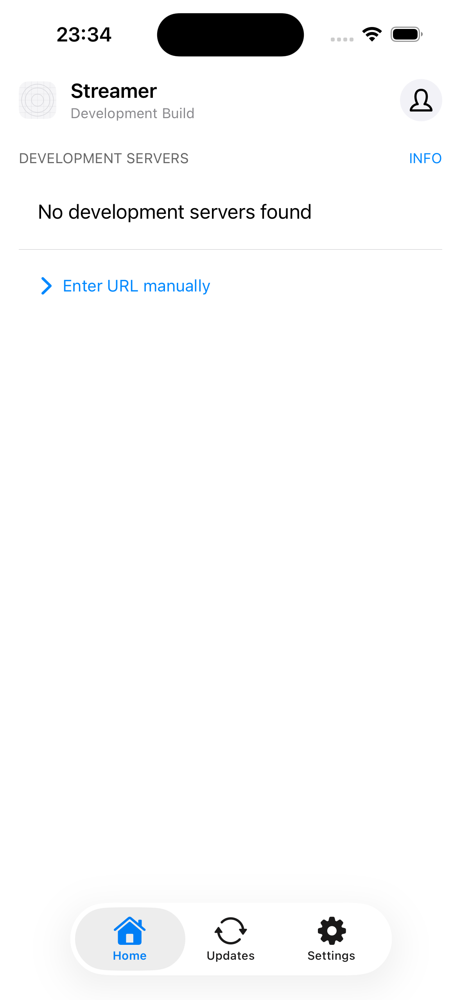

# QA Run: native targets and direct-stream disconnect

- Date: 2026-07-29
- Tester: local automation and simulator inspection
- Build/version/git SHA: uncommitted working tree on
  `codex/reliable-progress-and-seek`
- Host runtime: macOS, Node 24.18, npm 11.18, Xcode 26.6 (17F113)
- Scope: install the configured iOS Simulator and Android Emulator targets,
  prove bounded native usability, align the committed Detox iOS product
  identity, and regress the attached stream-server disconnect crash.

## Result

| Check                               | Result  | Evidence                                                                                                                                      |
| ----------------------------------- | ------- | --------------------------------------------------------------------------------------------------------------------------------------------- |
| iOS runtime                         | Pass    | Xcode-selected iOS 26.5 runtime build 23F77 installed for the iPhoneSimulator 26.5 SDK.                                                       |
| iPhone simulator                    | Pass    | `iPhone 15` (`9E73AFE8-3C33-4290-81F1-A76D2C135F3B`) booted through SpringBoard.                                                              |
| Disposable iOS build                | Pass    | Expo prebuild, 120 CocoaPods dependencies/130 pods, and a Debug simulator `Streamer.app` build completed.                                     |
| iOS install and launch              | Pass    | Bundle `com.bbrowns.streamer` installed and launched twice, including after runtime cleanup; the second launch returned PID 99581.            |
| Android system image                | Pass    | `system-images;android-34;google_apis;arm64-v8a` revision 14 installed with API 34 platform/build tools.                                      |
| Android AVD                         | Pass    | Exact Detox AVD name booted as `emulator-5554`; `sys.boot_completed=1`, SDK 34, ABI `arm64-v8a`.                                              |
| Repository native preflight         | Partial | Android reports `Ready`. iOS prerequisites are present, but the committed CNG project intentionally has no generated `apps/mobile/ios/` tree. |
| Direct-stream disconnect regression | Pass    | Focused torrent tests: 66/66. Full stream-server suite: 14 files, 171 tests. Typecheck passed.                                                |
| Native playback/Detox journey       | Not run | No Metro/API-backed app journey, source playback, or Detox suite ran.                                                                         |

The historical Android AVD name ends in `x86_64` because that is the committed
Detox target identity. Its actual system image is ARM64, which is the native ABI
for this Apple Silicon host.

The iOS screenshot proves installation and process launch into the Expo
development-client shell. It does not prove the Streamer JavaScript app or
playback because no Metro development server was attached:



## Direct-stream regression

The attached failure was a normal player disconnect being converted by
WebTorrent's streamx implementation into an unhandled
`Writable stream closed prematurely` source error. The uncaught event exited
the stream-server bridge process.

The direct full-response and byte-range paths now register source-error,
request-abort, and response-close handling before `pipe()`. An unfinished
consumer close cleanly destroys only that response's source stream. Genuine
source errors close the HTTP response and log a redacted message. Regression
coverage includes full and ranged disconnects, request abort, a response that
was already closed before piping, and sensitive-data redaction.

The same lifecycle helper now protects the legacy direct torrent handler.

## Target setup details

The first explicit iOS 26.5 download selected runtime build 23F73. Xcode 26.6
did not accept that build as the preferred match for its SDK. Running Xcode's
default platform download selected build 23F77; `xcodebuild -showdestinations`
then exposed the iPhone 15 and the native app build passed. The redundant 23F73
runtime was deleted by its exact CoreSimulator UUID, leaving only the proven
23F77 build.

The repository's Detox iOS build previously referenced
`mobile.xcworkspace`, scheme `mobile`, and `mobile.app`. Expo generates
`Streamer.xcworkspace`, scheme `Streamer`, and `Streamer.app`; the committed
configuration now matches those generated product names and a preflight unit
test locks that contract.

## Reproduction

```bash
npm run native:evidence:preflight:test
npm run native:evidence:preflight
npm run test --workspace=@streamer/stream-server -- src/__tests__/torrent.test.ts
npm run test --workspace=@streamer/stream-server
npm run typecheck --workspace=@streamer/stream-server
```

The iOS build was produced from a disposable copy after:

```bash
npx expo prebuild . --platform ios --no-install --clean
env -u GEM_PATH -u GEM_HOME pod install
xcodebuild -workspace Streamer.xcworkspace -scheme Streamer \
  -configuration Debug -sdk iphonesimulator \
  -destination 'platform=iOS Simulator,name=iPhone 15,OS=26.5' \
  -derivedDataPath build CODE_SIGNING_ALLOWED=NO build
```

## Evidence boundary

This is target-installation and native-launch evidence, not a native playback
pass. Generated iOS and Android projects remain uncommitted, as expected for the
Expo CNG workflow. Physical iPhone and Android devices, Detox journeys,
multi-audio switching, subtitles, PiP, Cast, download behavior, real providers,
real torrent swarms, and codec-specific playback remain untested on native
targets.
